# Summary

This report documents a reproducible research project that translates an original R-based sentiment analysis of mobile banking app reviews into Python, extends it with newly scraped data, and augments the lexicon-based methods with a transformer (BERT) approach. The project covers five major US banks: Bank of America, Chase, Citi, Marcus by Goldman Sachs, and Wells Fargo across the Apple App Store (iOS) and Google Play (Android). The core research questions are: (1) Can the original R findings be faithfully reproduced in Python? (2) Do the results change with a fresh data scrape? (3) Does a transformer model produce sentiment classifications consistent with the lexicon approach?

# 1. Introduction and Motivation

## 1.1 Research Context

Customer reviews on mobile app stores represent a rich, continuously updated source of unstructured opinion data. For the banking sector, app reviews offer direct evidence of customer satisfaction, pain points, and competitive positioning — feedback that often offers a faster point of view and is more granular than traditional survey methods. Sentiment analysis of these reviews can help researchers and practitioners understand how user experience varies across institutions and platforms, and whether negative signals co-occur with specific feature complaints or rating patterns.

There are two motivations for this study. Academically, it provides an opportunity to practice reproducible research: taking an existing empirical study, replicating it in a different computational environment, and evaluating whether the results remain the same. Practically, it investigates whether mobile banking sentiment has shifted between the original data collection window and a fresh scrape in 2026, and whether more sophisticated deep learning methods agree with classic dictionary-based approaches.

## 1.2 Inspiration and Source Study

The project is inspired by the tidytext-based workflow popularised by @silge2017text, which applies lexicon-based sentiment scoring to tokenised text in a tidy data format. The original analysis follows this approach: it imports and cleans review data, performs unigram sentiment analysis using three lexicons (Bing, AFINN, NRC), constructs bigrams with negator-aware scoring, and evaluates results statistically. The goal of this project is to demonstrate that these findings are reproducible — the same pipeline, implemented in Python with equivalent libraries, produces consistent conclusions — and then to extend the study in two directions: new data and a transformer model.

# 2. Data

Dataset is obtained with the means of scrapping reviews from the App Store and Google Play for the five major banks in US. The original dataset was collected in 2023, while the new dataset was scraped in mid-2026. Both datasets contain reviews in English, with metadata including star ratings, review text, date, platform, and storefront. The data is stored as CSV files per bank and platform, which are combined and preprocessed for analysis.

The major banks included in the dataset are some of the largest US financial institutions, which are: Bank of America, Chase, Citi, Marcus by Goldman Sachs, and Wells Fargo. Each has a significant mobile banking user base. The platforms covered are the two dominant mobile ecosystems: Apple's App Store (iOS) and Google's Play Store (Android). This allows for cross-platform comparisons and insights into whether user sentiment differs by operating system.

The method of scrapping differs for each platform due to their distinct APIs and structures. For the iOS App Store, the script uses Python's requests library to directly parse Apple's publicly accessible XML/JSON RSS feed endpoints, which are ordered by the most recent submissions. For the Google Play Store, it leverages an open-source web scraping library (google-play-scraper) that mimics browser requests to dynamically fetch and page through raw review payloads using continuation tokens. Both approaches process these external data streams in real time, converting the raw JSON responses into structured Pandas DataFrames before exporting them to CSV files.

## 2.1 Exploratory Data Analysis of the Original Dataset (Old Data)

The original dataset was collected in 2025 using a combination of web scraping and API access methods. It includes reviews from the same five banks and both platforms, but covers a different time period than the new data. The dataset is stored as CSV files, one per bank and platform, with columns for review text, star rating, date, and other metadata. The original analysis applied lexicon-based sentiment scoring to this dataset to derive insights about user sentiment and its relationship to star ratings.

## 2.2 Exploratory Data Analysis of the New Dataset (New Data)

The new dataset was collected using a dedicated scraper (`Dataset/scraper.ipynb`) targeting the same five banks and both platforms. The scraping window covers a more recent period - *early 2026*. While the column structure is identical to the old dataset, the new data captures a different temporal slice of user opinions and may reflect changes in app features, service quality, or competitive dynamics that occurred after the original collection window.
Upon checking, the rating distribution of the new data is similar to the original one, with the majority of reviews are at extreme positions, either 1 or 5 stars (@fig-star-dist-new).

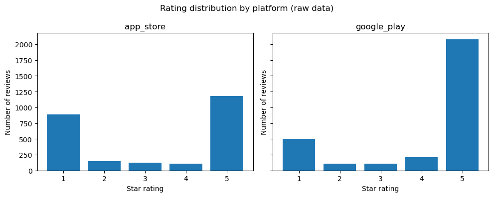{#fig-star-dist-new width=90%}

The top 20 most frequent bigrams in the new dataset reveal a clear thematic structure in how users discuss their mobile banking experience (@fig-bigram-new). Customer service is by far the most frequent bigram (~220 occurrences), nearly 25% more common than the second-ranked Wells Fargo (~175), which appears frequently as a named entity within reviews of that bank. Credit card (~150) and user friendly (~115) round out the top four, reflecting that product features and usability remain central to how users articulate their experience.

Several bigrams signal recurring friction points: no longer (~65), bring back (~42), please fix (~38), and blank screen (~37) all indicate users reacting to feature removals or technical failures.

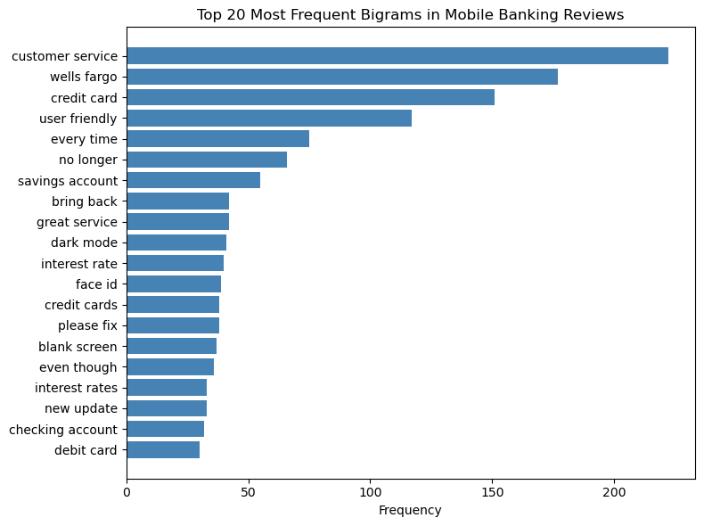{#fig-bigram-new width=90%}

## 2.3 Data Preprocessing
### 2.3.1 Data Preprocessing for Lexicon-Based Methods

Preprocessing follows the same logical steps in both the R original and the Python replications:

1. **Import and combine** - all per-bank CSVs are concatenated into a single dataframe
2. **Bank and platform standardisation** — filenames are parsed to extract bank names; platform codes (`app_store` → `iOS`, `google_play` → `Android`) are mapped to readable labels
3. **Type coercion** — `rating` is cast to numeric; `date` is parsed to datetime
4. **Language detection** — reviews not detected as English are removed (using `langdetect` in Python)
5. **Raw text construction** — `title` and `review` fields are concatenated into `raw_text`
6. **Tokenisation and stopword removal** — words are extracted using regex; a custom stopword list (NLTK English stopwords + domain terms: *app, bank, banking, mobile, iphone, apple, android, phone*) is applied
7. **Bigram construction** — adjacent word pairs are extracted from cleaned text, with negators (*not, never, no, cannot*, etc.) explicitly excluded from the stopword filter so they are preserved in bigrams

### 2.3.2 Data Preprocessing for Transformer Methods

For the transformer approach, an additional cleaning step keeps punctuation intact (since BERT tokenisers handle it natively) and removes URLs.

# 3. Methodology
## 3.1 Lexicon-Based Sentiment Analysis

Three lexicons are applied to the filtered tokens. Scores are computed at the review level and disaggregated by bank and platform.

**Bing (Opinion Lexicon):** A binary lexicon classifying words as positive or negative. Review sentiment is the count of positive words minus negative words.

**AFINN:** An integer-scored lexicon (−5 to +5) [@nielsen2011new]. Review scores are the sum of matched word scores. Pearson correlation between AFINN scores and star ratings serves as a validity check.

**NRC Emotion Lexicon:** Developed by @mohammad2013crowdsourcing, this lexicon maps words to 8 emotion categories (anger, anticipation, disgust, fear, joy, sadness, surprise, trust) and 2 polarity categories. One word may belong to multiple categories, enabling nuanced emotion profiling.

## 3.2 Bigram Analysis and Negation Correction

Unigram methods cannot handle negation: *not good* is scored as positive because *good* carries a positive AFINN score. To quantify this limitation, bigrams are constructed from the raw review text, with negators explicitly retained in the stopword filter. A set of 22 negators is defined (e.g., *no*, *not*, *n't*, *never*, *cannot*). Where the first token of a bigram is a negator and the second has an AFINN score, the score is sign-flipped. The magnitude of the resulting correction is reported by star-rating group.

## 3.3 Transformer-Based Sentiment Analysis

As a complement to the lexicon methods, the pre-trained model `nlptown/bert-base-multilingual-uncased-sentiment` [@nlptown2019] is applied via the Hugging Face `transformers` pipeline. The model predicts a 1–5 star rating for each review; predictions are normalised to a continuous sentiment score:

$$\text{bert\_score} = \frac{\text{bert\_stars} - 1}{4} \in [0, 1]$$

Model validity is assessed by (1) Pearson correlation between `bert_score` and the actual star rating (95% CI via Fisher's *z*-transformation), (2) boxplots of `bert_score` stratified by star rating, bank, and platform, (3) exact star-level agreement and a full confusion matrix, and (4) a Mann–Whitney U test comparing platform distributions.

# 4. Results

## 4.1 Results Python vs R

This section aims to answer the first research question of our study: **Can the original R findings be faithfully reproduced in Python?** The Python results are compared with the file `original-sentiment-analysis-report`, stored in the folder `original_r_report`. The project aimed to directly replicate the R results in Python. However, due to several methodological and technical limitations, full reproduction was not possible.

**Data Pre-processing**

The first differences appeared already at the data pre-processing stage, especially during language detection. The original R analysis used the function `cld3::detect_language(raw_text)`, which comes from the R package `cld3`. This function cannot be directly used in standard Python code because it belongs to the R ecosystem. Therefore, in the Python version, we used the `langdetect` package instead.

However, `langdetect` and R’s `cld3` are different language detection tools. They use different models and rules when classifying the language. As a result, Python identified 4,518 English reviews, while R’s `cld3` identified 4,213 English reviews. Since different tools had to be used, this part of the analysis could not be fully reproduced. In Python, only 17.1% of reviews were removed as non-English, while in R, 22.7% of reviews were treated as non-English and removed from the dataset.

This difference also affects the following stopword removal step. The R project used `tidytext::stop_words`, while the Python project used scikit-learn’s `ENGLISH_STOP_WORDS`. These stopword lists are not identical. This changes the token list before sentiment lexicon matching.

Tokenization methods also differ between the two workflows. R used `unnest_tokens()`, while Python used regular-expression-based tokenization. This limitation affected the number of tokens.

Lastly, we decided to extend the Python study by including lemmatization, which is a common technique in lexicon-based sentiment analysis. Lemmatization was not included in the original R preprocessing pipeline. We hoped that including this step will make our results more reliable compared to the R project, which skipped this part of data pre-processing.

**Bing Sentiment Analysis**

Both the R and Python plots show that positive Bing words appear more often than negative Bing words (@fig-r-bing-distribution and @fig-lexicon-old-bing-distribution). However, the difference between positive and negative words is much larger in the Python plot. In the original R version, the two bars are relatively close, while in the Python version the positive bar is almost twice as high as the negative bar. Python preprocessing kept or created more positive sentiment matches, especially after using a different stopword list and lemmatization.

::: {layout-ncol=2 fig-pos="H"}
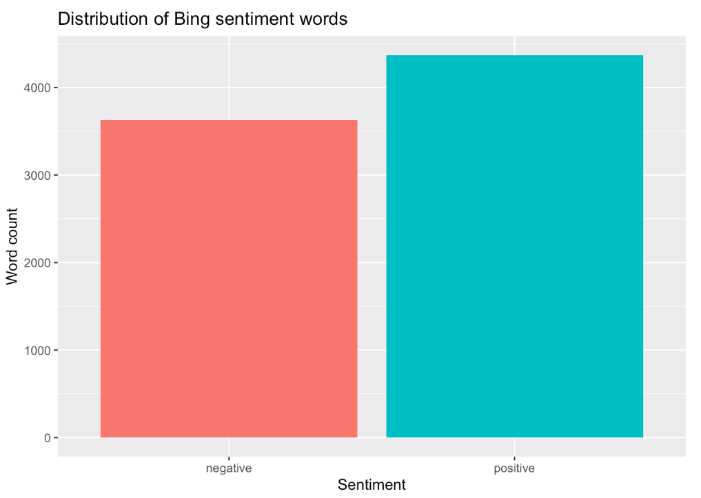{#fig-r-bing-distribution width=90% fig-pos="H"}

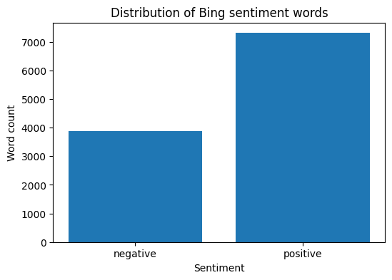{#fig-lexicon-old-bing-distribution width=90% fig-pos="H"}
:::

Results show that most review-level Bing sentiment scores are close to zero or slightly positive (@fig-r-bing-review-lvl and @fig-lexicon-old-bing-review-lvl). The Python distribution is more concentrated around small positive values and has a wider range of extreme scores. The R version appears more spread around both negative and positive values. This suggests that the Python preprocessing may have increased positive matches at the review level.

::: {layout-ncol=2 fig-pos="H"}
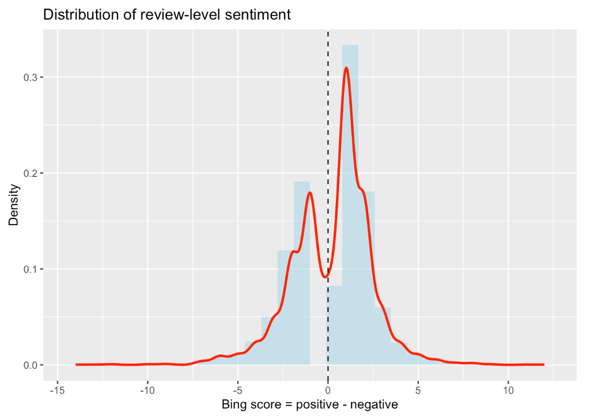{#fig-r-bing-review-lvl width=90% fig-pos="H"}

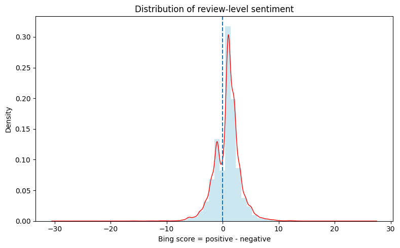{#fig-lexicon-old-bing-review-lvl width=90% fig-pos="H"}
:::

Both versions reproduce the expected relationship between star rating and Bing sentiment score (@fig-r-bing-review-sentiment-star and @fig-lexicon-old-bing-sentiment-star). Lower-rated reviews generally have more negative sentiment scores, while higher-rated reviews have more positive sentiment scores. However, the Python plot shows slightly higher sentiment scores for 3-star reviews and a positive shift for 4- and 5-star reviews.

::: {layout-ncol=2 fig-pos="H"}
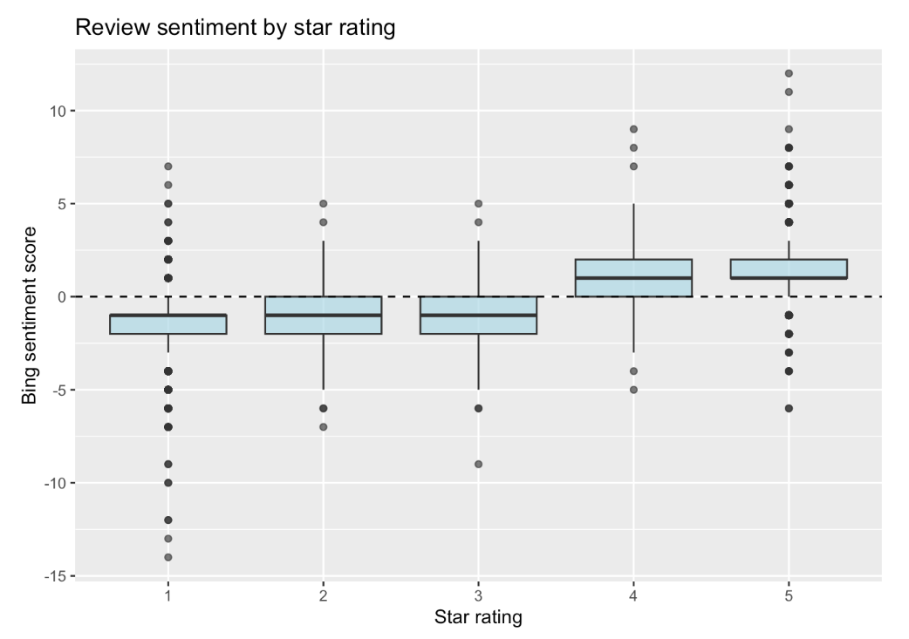{#fig-r-bing-review-sentiment-star width=90% fig-pos="H"}

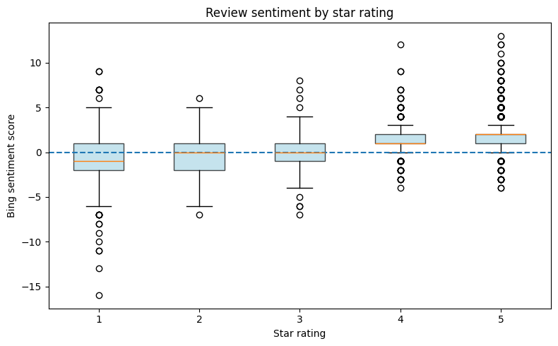{#fig-lexicon-old-bing-sentiment-star width=90% fig-pos="H"}
:::

**AFINN Sentiment Analysis**

The bank and platform plot shows one of the clearest differences between the R and Python results (@fig-r-afinn_avg_sentiment and @fig-lexicon-old-afinn_avg_sentiment). In the R version, some iOS results are negative, especially for Citi, Bank of America, and Chase. In the Python version, most bank-platform combinations become positive, with only Citi on iOS remaining slightly negative. This suggests that the Python version changes the strength of the bank-level interpretation.

::: {layout-ncol=2 fig-pos="H"}
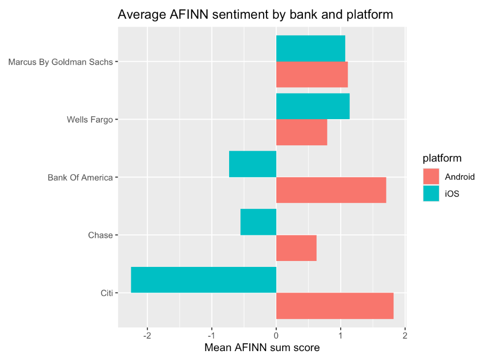{#fig-r-afinn_avg_sentiment width=90% fig-pos="H"}

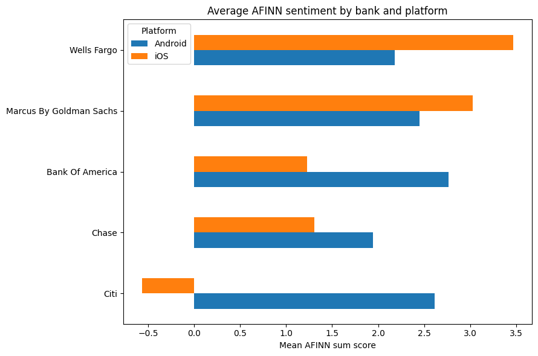{#fig-lexicon-old-afinn_avg_sentiment width=90% fig-pos="H"}
:::

**NRC Sentiment Analysis**

Both versions show the same overall ranking of NRC emotion categories (@fig-r-nrc_emotion and @fig-lexicon-old-nrc_emotion). In both R and Python, *positive* is the most common category, followed by *trust*. The categories *negative*, *anticipation*, and *joy* also remain important in both versions, while *disgust* appears the least often.

However, the Python plot shows higher counts overall. For example, positive NRC matches increased from 5,809 in R to 6,852 in Python, and trust increased from 4,417 to 5,160. Therefore, this result can be considered reproducible in terms of the general category ranking, but not in terms of the exact values.

::: {layout-ncol=2 fig-pos="H"}
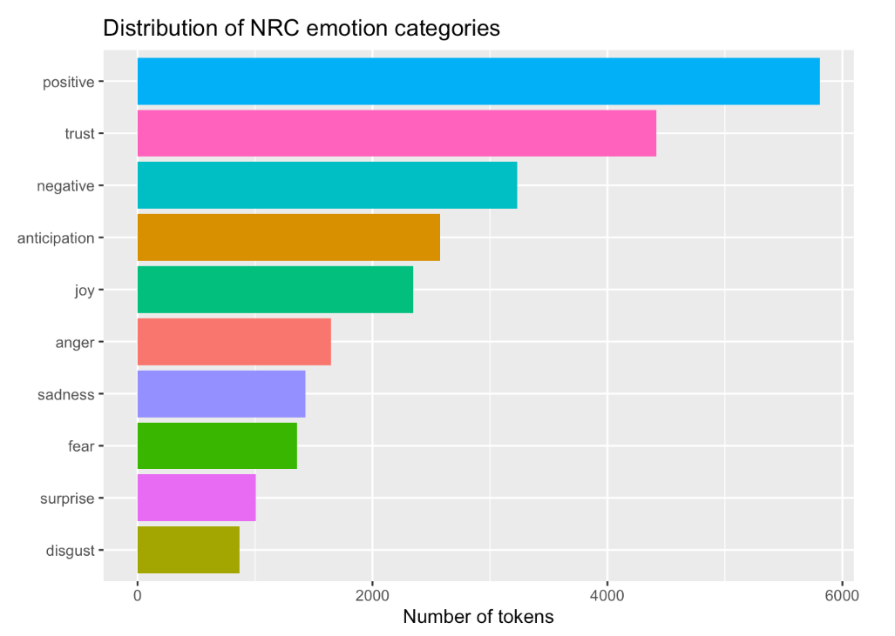{#fig-r-nrc_emotion width=90% fig-pos="H"}

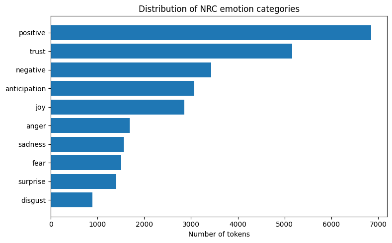{#fig-lexicon-old-nrc_emotion width=90% fig-pos="H"}
:::

**Bigrams**

Both versions show that *customer service* is the most frequent bigram (@fig-r-bigrams and @fig-lexicon-old-bigrams). This means that customer service remains one of the main themes in mobile banking reviews in both R and Python. Other important phrases, such as *credit card*, *user friendly*, *savings account*, and *dark mode*, also appear in both versions. Therefore, the main topic-level findings were reproduced.

However, the Python plot includes additional bigrams such as *don t*, *doesn t*, *won t*, and *t work*. These phrases come from contractions being split during tokenization. In the R version, contractions were handled differently, so these forms are less visible in the top bigrams. 

::: {layout-ncol=2 fig-pos="H"}
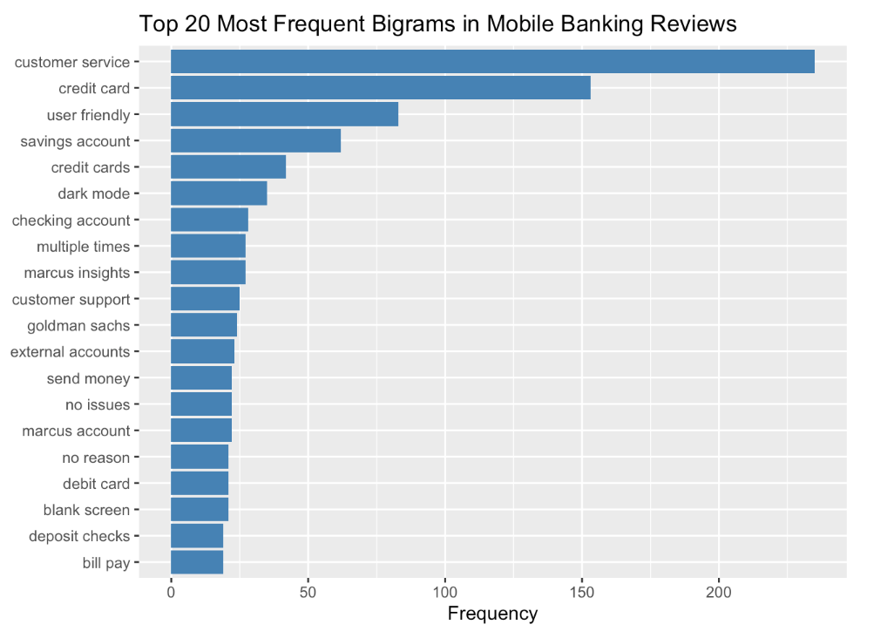{#fig-r-bigrams width=90% fig-pos="H"}

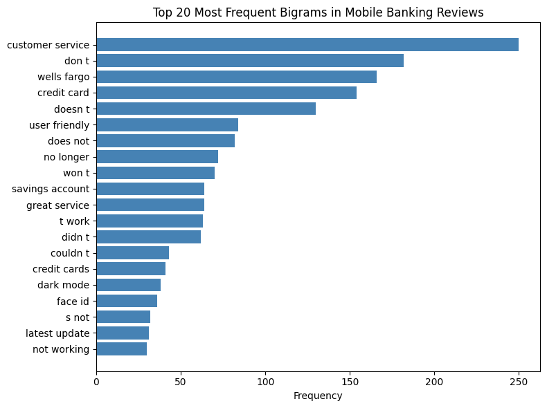{#fig-lexicon-old-bigrams width=90% fig-pos="H"}
:::

**Quantifying Negation Effect**

The plot shows that negation has the strongest effect on lower-rated reviews (@fig-r-negation and @fig-lexicon-old-negation). In both R and Python, 1-star and 2-star reviews receive the largest negative correction. The Python plot shows a stronger negative correction than the R plot, especially for 1-star and 2-star reviews. For higher-rated reviews, the negation effect is much smaller. 

::: {layout-ncol=2 fig-pos="H"}
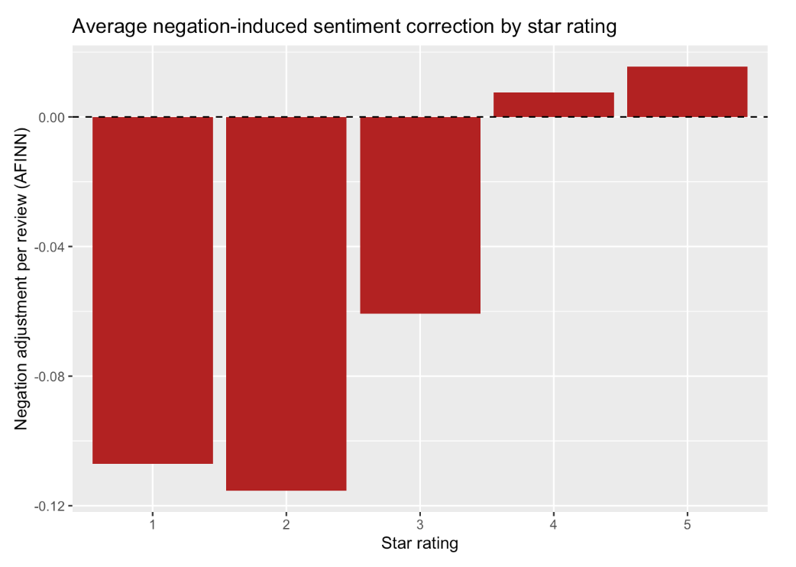{#fig-r-negation width=90% fig-pos="H"}

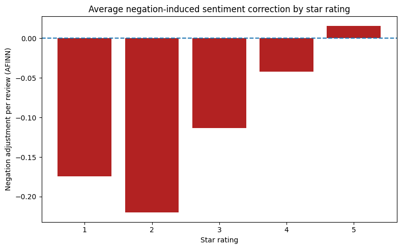{#fig-lexicon-old-negation width=90% fig-pos="H"}
:::

**Comparing Unigram vs Bigram with Negation**

Both versions show the same general pattern: reviews with lower star ratings have more negative sentiment scores, while reviews with higher star ratings have more positive scores (@fig-r-overall and @fig-lexicon-overall). However, the Python plot shows a stronger negation effect than the R plot. The difference between unigram sentiment and bigram-adjusted sentiment is larger in Python, especially for low-rated reviews. For higher-rated reviews, both R and Python show a smaller difference between unigram and bigram sentiment. 

::: {layout-ncol=2 fig-pos="H"}
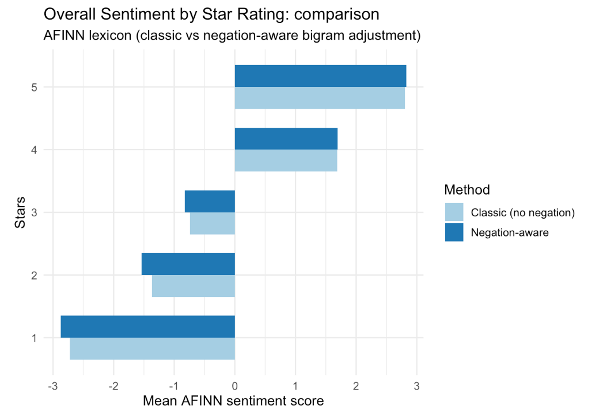{#fig-r-overall width=90% fig-pos="H"}

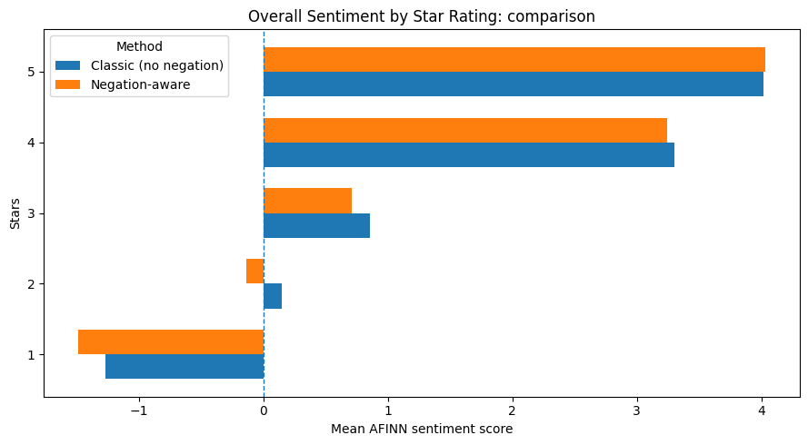{#fig-lexicon-overall width=90% fig-pos="H"}
:::

## 4.2 Results Old Data vs New Data - Lexicon Analysis
This section compares lexicon-based sentiment results across three lexicons (Bing, AFINN, NRC)
between the original 2025 dataset and the newly scraped 2026 dataset. The new dataset contains
**4,478 reviews**, covering the same five banks and two platforms but a different temporal window. 

***BING***

In the new data, the Bing lexicon identified **7,363 positive** and **3,657 negative**
word tokens, yielding an overall positive-to-negative ratio of approximately 2.01:1. The
directional pattern of results is consistent with the original study: positive words dominate in
aggregate, and the platform gap observed in the old data persists — Android reviews skew more
positive than iOS reviews across most banks (@fig-bing-word-new-pf and @fig-bing-word-new-bank).

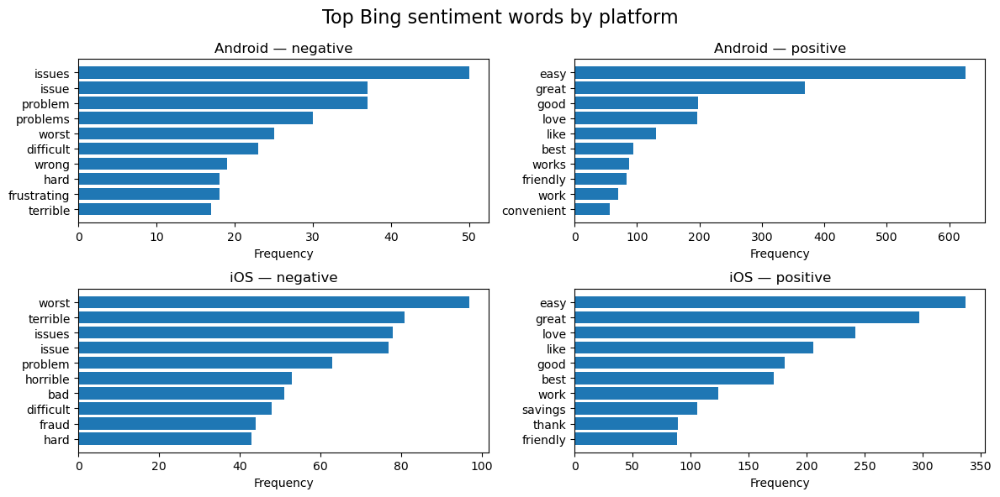{#fig-bing-word-new-pf width=90% fig-pos="H"}

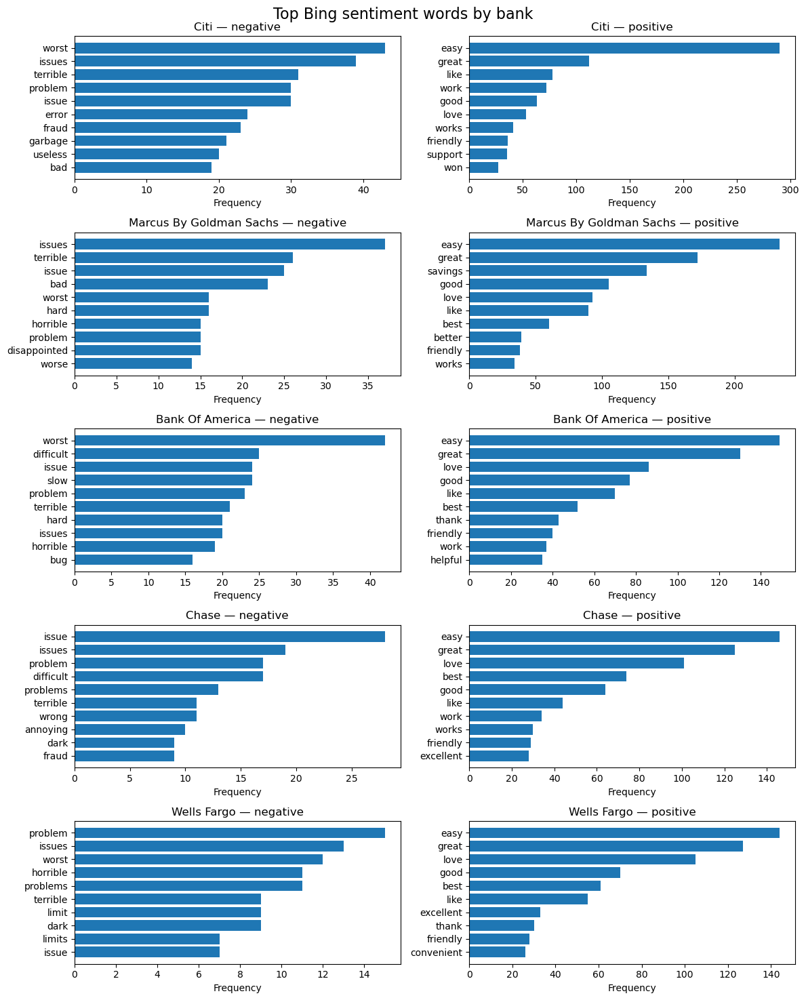{#fig-bing-word-new-bank width=90% fig-pos="H"}

***AFINN***

The AFINN analysis of the new data yields a Pearson correlation between review-level AFINN sum
scores and star ratings of **r = 0.539** (n = 3,885; 95% CI: [0.516, 0.561]; p < 0.001). This
is a moderate-to-strong positive correlation, confirming that higher AFINN scores correspond to
higher user ratings — the same directional conclusion as the original data.

Compared to the old dataset, the correlation in the new data is **slightly lower** (the original study
reported a Pearson correlation at 0.59).
This small reduction in predictive alignment may reflect the greater temporal concentration of
recent reviews around extreme ratings (1 and 5 stars), which inflates the role of polarity
extremes and reduces mid-range discrimination. 

The per-bank AFINN mean-sum scores reveal an interesting structural shift (@fig-afinn-bank-new):
**Citi iOS** is the only bank–platform cell with a *negative* mean AFINN sum score (−0.724). All other bank–platform cells remain
positive. **Wells Fargo iOS** posts the highest mean AFINN sum (3.80) in the new data, followed
by **Marcus by Goldman Sachs iOS** (3.12) and **Chase iOS** (2.99). On Android, scores are more
tightly clustered, ranging from approximately 1.9 (Chase) to 2.6 (Citi Android), which is broadly
consistent with the old data.

{#fig-afinn-bank-new width=90% fig-pos="H"}

***NRC Emotion***
The NRC emotion profile in the new data is dominated by **positive** (6,941 tokens) and
**trust** (5,281 tokens), together accounting for over 44% of all matched tokens — a pattern
that mirrors the old data and is consistent with the service-oriented nature of banking apps, where
trust vocabulary (*account*, *recommend*, *secure*) is naturally frequent.

The platform breakdown reveals a structurally important asymmetry
(@fig-nrc-dist): Android reviews show a markedly higher *positive* proportion (26.9% of
tokens) compared to iOS (23.8%), while iOS shows higher *negative* (12.8% vs 9.8%), *anger*
(5.9% vs 4.5%), *fear* (5.4% vs 3.8%), and *sadness* (5.7% vs 3.8%) proportions. This
Android–iOS emotional gap is consistent across both datasets and reinforces the finding from the
BERT analysis that Android users express systematically more positive sentiment than iOS users — a
pattern that warrants further investigation into whether it reflects genuine experience differences
or platform-specific reviewer demographics.

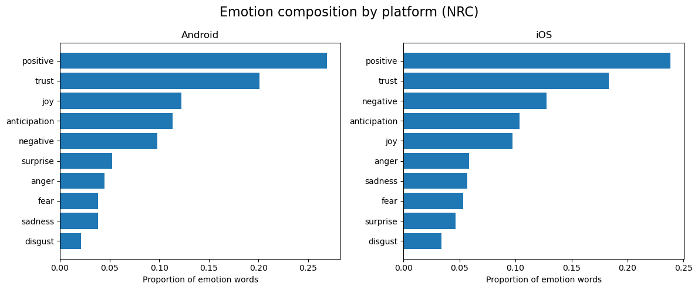{#fig-nrc-dist width=90% fig-pos="H"}

***Bigram and Negation Analysis***

The top bigrams in the new data are largely consistent with the old data: *customer service*,
*credit card*, *user friendly*, *savings account*, and *checking account* dominate the
co-occurrence table. Two new entries — *dark mode* (rank 13) and *blank screen* (rank 16) —
suggest that UI/UX concerns specific to the late 2025 to early 2026 period have increased in salience.

The negation correction analysis confirms the structural finding from the original study: 1-star
reviews show the largest total negation shift (−216 across the dataset, averaging −0.164 per
review), reflecting that negative reviews contain the most negator–sentiment bigrams. Crucially,
the sign of the correction is *negative* for 1–4 star reviews but *positive* for 5-star reviews
(total shift +63), meaning that naive unigram AFINN systematically underestimates negativity in
low-rated reviews and underestimates positivity in top-rated reviews. This directional finding
holds in both the old and new data, confirming that negation correction is not a temporal artifact
but a structural property of this type of review language.

The most frequent negated bigrams are *no problems* (16 occurrences, flipped from −2 to +2),
*not allow* (15), *not happy* (12), *no problem* (11), and *no help* (10) - indicating that
both false-negative corrections (e.g., *not happy* correctly flipped to negative) and
false-positive corrections (e.g., *no problems* correctly flipped to positive) are present in
meaningful quantities, broadly consistent with the pattern in the original data.

yap yap yap

## 4.3 Comparison of BERT Sentiment Results Across Preprocessing Approaches
This section compares the outputs of the BERT-based sentiment classifier `(nlptown/bert-base-multilingual-uncased-sentiment)` applied to two versions of the dataset: one preprocessed using the original pipeline and one using the revised approach. Both versions were scored using identical model settings and scoring logic, with predicted star ratings mapped to a normalized sentiment score in the range [0, 1]. The comparison focuses on whether the revised preprocessing affects the distribution of predicted sentiment, its alignment with actual star ratings, and the relative sentiment profiles across banks and platforms.

**Distribution of BERT Predicted Sentiment**

Both datasets produce a broadly similar bimodal distribution of BERT-predicted sentiment, with the majority of reviews classified at either the negative extreme (1 star) or the positive extreme (5 stars), and relatively few reviews falling in the middle ratings of 2 through 4 (@fig-bert-dist-old and @fig-bert-dist-new). However, a notable difference emerges in the balance between the two poles. In the older data, the 1-star predicted count (~1,550) is considerably closer to the 5-star predicted count (~2,000), whereas in the newer data the gap widens, with 1-star predictions declining to approximately 1,380 while 5-star predictions rise to around 2,100 (@fig-bert-dist-new). This suggests that the newer batch of reviews contains a higher proportion of positively-perceived content as classified by the model. The sentiment score density plots reinforce this pattern: both distributions are heavily concentrated at 0.0 and 1.0, reflecting the model's tendency toward confident polar predictions, with the overall shape of the density curve remaining consistent across both datasets (@fig-bert-dist-old and @fig-bert-dist-new).

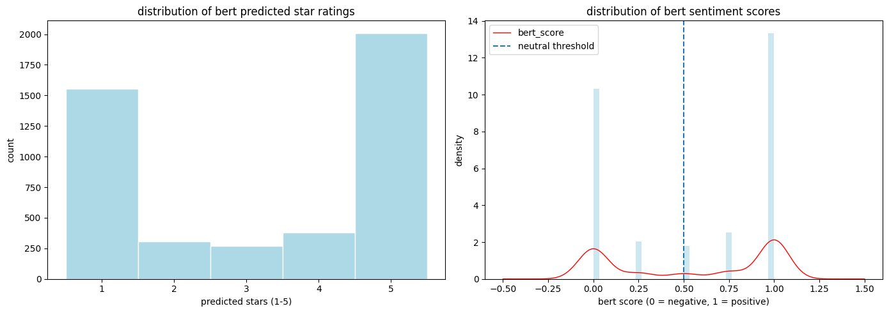{#fig-bert-dist-old width=90%}

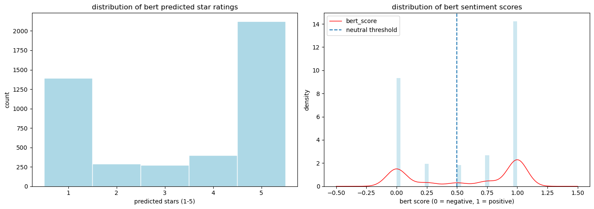{#fig-bert-dist-new width=90%}

**Relationship Between BERT Scores and Actual Star Ratings**

The relationship between BERT sentiment scores and actual star ratings is consistent across both datasets (@fig-bert-box-old and @fig-bert-box-new). In both cases, the model assigns near-zero sentiment scores to 1-star reviews with very tight interquartile ranges, indicating high confidence in negative classifications. Scores rise progressively through 2- and 3-star ratings, with 3-star reviews showing the widest spread, reflecting the model's uncertainty around neutral or mixed-sentiment reviews. Reviews rated 4 and 5 stars are predominantly scored above the neutral threshold of 0.5, with 5-star reviews showing a highly compressed distribution concentrated at 1.0. The two datasets are visually near-identical in this regard (@fig-bert-box-old and @fig-bert-box-new), suggesting that the shift in review composition between the older and newer data did not meaningfully alter the model's ability to align predicted sentiment with actual star ratings.

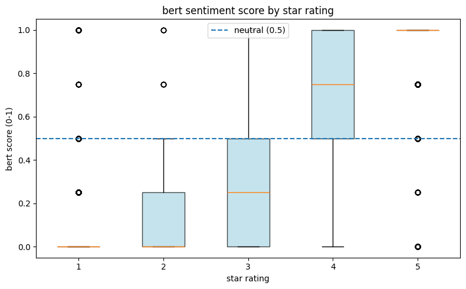{#fig-bert-box-old width=90%}

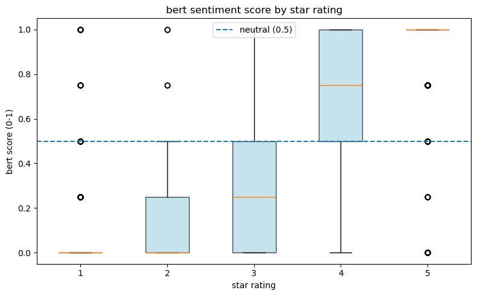{#fig-bert-box-new width=90%}

**Average BERT Sentiment Scores by Bank and Platform**

Across both datasets, a consistent platform gap is visible: Android reviews tend to receive higher BERT sentiment scores than iOS reviews for most banks (@fig-bert-bank-old and @fig-bert-bank-new). Citi stands out in both periods, with Android scores approaching 0.9 while iOS scores remain well below the neutral threshold of 0.5, making it the most polarised bank by platform in both the older and newer data. Bank of America shows a similar pattern, with strong Android sentiment but iOS scores falling below neutral in both datasets. Wells Fargo is the only bank where both platforms consistently score above neutral, and remains so across both periods. One notable structural difference between the two datasets is that Chase appears in the older data (@fig-bert-bank-old) with both platforms scoring above neutral, whereas in the newer data (@fig-bert-bank-new) Chase drops to the bottom of the ranking with iOS sentiment just at the neutral threshold. Marcus by Goldman Sachs remains relatively stable across both periods, with Android scores moderately above neutral and iOS scores hovering near 0.5.

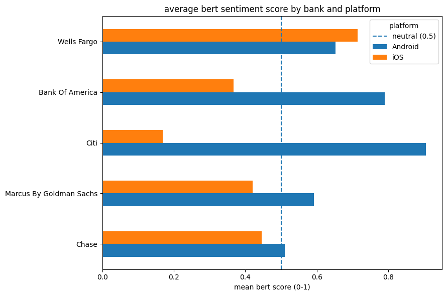{#fig-bert-bank-old width=90%}

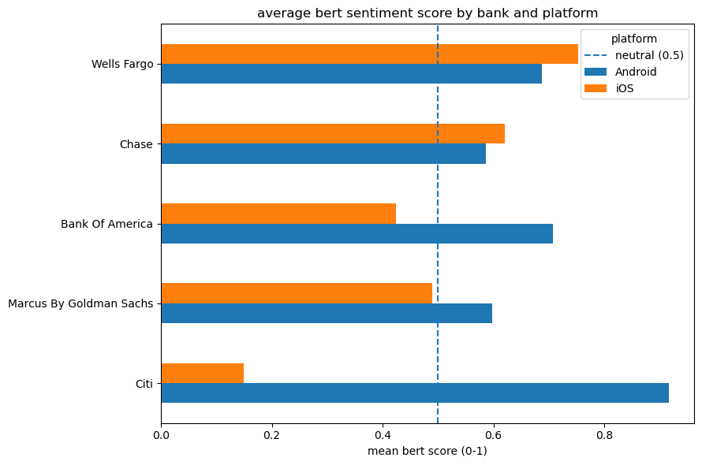{#fig-bert-bank-new width=90%}

**Average BERT Sentiment Scores by Operating Platform**

The per-platform breakdown of BERT sentiment scores by star rating reveals a largely stable pattern across both datasets (@fig-bert-plat-old and @fig-bert-plat-new). On Android, both the older and newer data show near-identical distributions: 1-star reviews are tightly concentrated at 0.0, scores rise progressively through 2 and 3 stars with widening spread, and 4- and 5-star reviews sit predominantly above the neutral threshold. The iOS platform tells a slightly different story between the two periods. In the older data (@fig-bert-plat-old), the iOS 4-star distribution closely mirrors its Android counterpart, with a median around 0.75. In the newer data (@fig-bert-plat-new), the iOS 4-star box shifts noticeably, with a lower median of approximately 0.6 and a wider interquartile range, suggesting greater variability in how the model scores moderately positive iOS reviews in the newer period. Across both datasets and platforms, 1- and 2-star distributions remain consistently low and 5-star reviews remain compressed near 1.0, indicating that the model's confidence at the sentiment extremes is robust regardless of platform or time period.

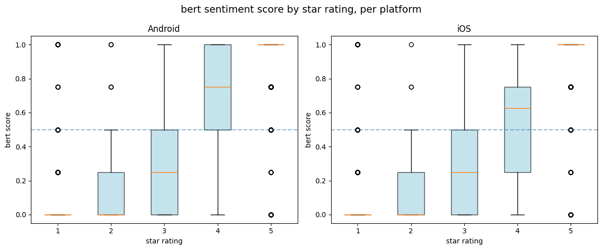{#fig-bert-plat-old width=90%}

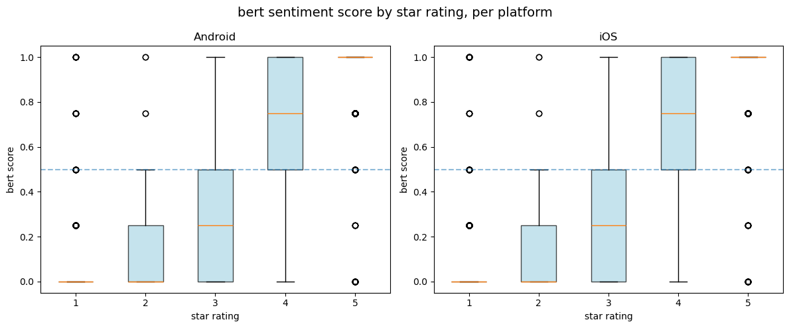{#fig-bert-plat-new width=90%}

**Statistical Correlation Between BERT Scores and Star Ratings**

| Metric | Old Data | New Data |
|---|---|---|
| n | 4,518 | 4,478 |
| Pearson r | 0.8615 | 0.8660 |
| p-value | < 0.001 | < 0.001 |
| 95% CI | [0.8538, 0.8688] | [0.8585, 0.8731] |

Both datasets show a strong positive correlation between BERT sentiment scores and actual star ratings, with Pearson r values of 0.8615 and 0.8660 for the older and newer data respectively, both statistically significant (p < 0.001). The marginal increase in r across the two periods suggests a slightly stronger alignment between model-predicted sentiment and user-assigned ratings in the newer dataset, though the difference is negligible given the overlapping confidence intervals ([0.8538, 0.8688] vs [0.8585, 0.8731]). Overall, these results confirm that the BERT model captures sentiment signal consistently across both time periods.

**Statistical Correlation Between BERT Scores and Users' Platforms**

| Metric | Old Data | New Data |
|---|---|---|
| Platforms compared | Android vs iOS | Android vs iOS |
| U statistic | 3,379,410.0000 | 3,174,169.0000 |
| p-value | 3.23e-93 | 1.46e-63 |

Both datasets show a statistically significant difference in BERT sentiment scores between Android and iOS platforms (p < 0.001 in both cases), confirming that platform is a meaningful source of variation in user sentiment regardless of time period. The U statistic is larger in the older data (3,379,410 vs 3,174,169), which is consistent with the older dataset having slightly more observations (n = 4,518 vs 4,478). While both p-values are extremely small, the older data yields a more extreme test statistic, suggesting the platform gap in sentiment may have been marginally more pronounced in the earlier period, which aligns with what was observed in the bank-by-platform plots (@fig-bert-bank-old and @fig-bert-bank-new).

## 4.4 Comparison of AFINN and BERT Sentiment — New Data

This section compares the outputs of the AFINN lexicon-based model and the BERT-based sentiment classifier (`nlptown/bert-base-multilingual-uncased-sentiment`) applied to the newer dataset. AFINN assigns integer scores (−5 to +5) to matched tokens and aggregates them at the review level, while BERT predicts a 1–5 star rating from full review text, normalised to a sentiment score in [0, 1]. The comparison focuses on validity against actual star ratings, score distributions, and sentiment profiles across banks and platforms.

**Distribution of Predicted Sentiment**

The two models produce structurally different distributions. AFINN sum scores are unimodal and centred near zero, with a continuous range driven by review length and word count variation. BERT scores are strongly bimodal, with sharp density spikes at 0 - 1, reflecting the model's tendency to assign confident polar predictions (@fig-bert-box-new). AFINN therefore captures gradations of sentiment intensity across a wide unbounded scale, while BERT tends to classify reviews as clearly positive or clearly negative with little ambiguity in between.

A secondary structural difference is coverage: AFINN matched scored tokens in 86.8% of reviews, leaving 13.2% unscored due to out-of-vocabulary words. BERT scores all 4,478 reviews without missing values, as it operates on full review text rather than word-by-word lexicon lookup.

**Relationship Between Sentiment Scores and Actual Star Ratings**

Both models produce sentiment scores that increase monotonically with star ratings, confirming convergent validity. However, BERT outperforms AFINN in alignment with user-assigned ratings. AFINN achieves a Pearson correlation of r = 0.539, while BERT achieves r = 0.866 — a difference of 0.33 correlation points, reflecting BERT's capacity to capture contextual meaning beyond individual word scores.

Boxplots by star rating reveal a shared weakness at the 3-star midpoint: for genuinely mixed reviews, both AFINN and BERT show high variance and overlap with adjacent star categories. Neither model reliably distinguishes neutral sentiment from mildly positive or mildly negative reviews.

{#fig-bert-box-new width=90%}

**Average Sentiment Scores by Bank and Platform**

Both models agree on the direction of cross-bank sentiment differences in most cases. The strongest point of agreement is Wells Fargo iOS, which ranks highest under both models, and Citi iOS, which ranks lowest under both (AFINN mean_sum = −0.72, the only negative cell across all bank–platform combinations; BERT score ≈ 0.15).

The Citi platform is the most striking finding shared by both models: Citi Android reviews score positively under AFINN (mean_sum = 2.62) and very highly under BERT (≈ 0.90), while Citi iOS reviews are rated negatively by AFINN and near-zero by BERT. The magnitude of this divergence is more extreme under BERT.

For Bank of America, both models find Android reviews more positive than iOS, with the gap amplified under BERT. For Chase and Marcus by Goldman Sachs, both models find iOS reviews slightly more positive than Android (Chase AFINN: 2.99 vs 1.93; Chase BERT: ≈ 0.62 vs ≈ 0.59; Marcus AFINN: 3.12 vs 2.46; Marcus BERT: ≈ 0.50 vs ≈ 0.60), with consistent direction and small absolute differences.

{#fig-bert-bank-new width=90%}

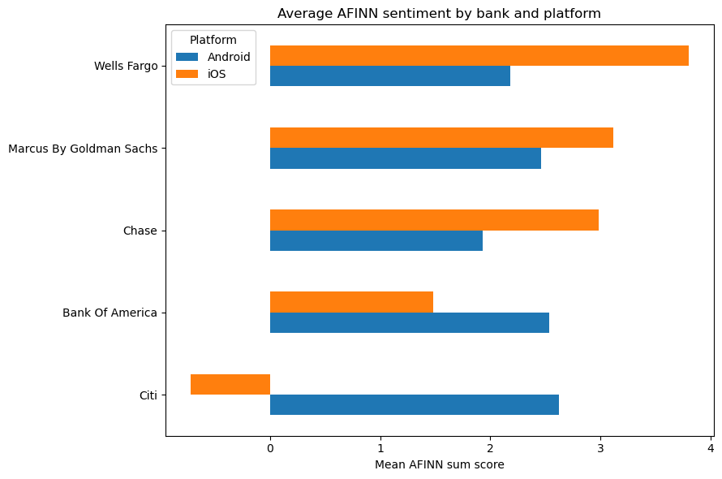{#fig-afinn-bank-new width=90%}

**Summary**

| Dimension | AFINN | BERT |
|---|---|---|
| Correlation with star rating | r = 0.539 | r = 0.866 |
| 95% CI | [0.516, 0.561] | [0.859, 0.873] |
| Review coverage | 86.8% (3,885 / 4,478) | 100% (4,478 / 4,478) |
| Score distribution | Unimodal, centred near 0 | Bimodal, peaks at 0 and 1 |
| 3-star reviews | High variance, unreliable | High variance, unreliable |
| Citi iOS | −0.72 (only negative cell) | ≈ 0.15 (lowest cell) |
| Wells Fargo iOS | 3.80 (highest cell) | ≈ 0.95 (highest cell) |
| Platform direction agreement | — | Consistent across all banks |

Both models consistently identify the same outlier patterns — Citi's platform asymmetry and Wells Fargo iOS's high sentiment — suggesting these findings are robust to method choice. Where they diverge most is in resolving ambiguous mid-range reviews and in overall alignment with star ratings, where BERT's higher correlation (r = 0.866 vs 0.539) and full coverage make it the more reliable instrument for this dataset.

# 5 Discussion

## 5.1 Reproducibility Assessment

Something about environment in python
Overall assesment about reproducibility, minor differences, but overall conclusions hold
Slight conclusions about the original study's robustness to language and implementation choices

The R-to-Python translation demonstrates that the core analytical conclusions
of the original study are reproducible across languages. Minor numerical
differences arise from:

- **Language detection:** `langdetect` vs `cld3` use different underlying
  models; the set of English-classified reviews may differ slightly
- **Stopword lists:** `tidytext::stop_words` differs from NLTK's English list
- **Bing lexicon size:** NLTK `opinion_lexicon` covers more words than the
  Bing lexicon embedded in tidytext

These are expected cross-language reproducibility gaps and do not undermine
the directional conclusions.

## 5.2 Limitations - AGAS

- **Lexicon coverage:** All three lexicons were built for general English, not
  financial app reviews — domain terms (*overdraft, Zelle, wire transfer*) may
  be absent
- **Negation scope:** The bigram correction handles only two-word negation;
  longer-range negation is not captured
- **Temporal confounding:** Old and new data cover different time windows, so
  observed differences may reflect temporal trends, not genuine quality changes
- **Label imbalance:** App Store reviews skew heavily toward 5 stars; without
  class-weighting, the transformer may over-predict "positive"

# 6 Generative AI Disclosure

In accordance with course policy (dr Jakub Michańków, Reproducible Research
2026), generative AI (Claude AI) was used to assist with coding tasks, refine the code.

All analytical decisions, interpretations, and research design are the
team's own work.

# References

::: {#refs}
:::
